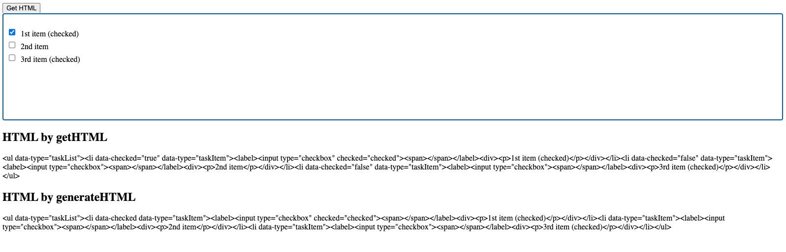

## REPL steps

```shell
npm install
npm run dev
```

## Bug description

After starting the dev server, you will see the following HTML.



The `HTML by getHTML` and `HTML by generateHTML` should be the same, but the data-checked value is different.

## How to solve this

Update [task-item.ts](https://github.com/ueberdosis/tiptap/blob/develop/packages/extension-task-item/src/task-item.ts#L70) as follows:

```diff
- 'data-checked': attributes.checked
+ 'data-checked': attributes.checked ? 'true' : undefined
```
